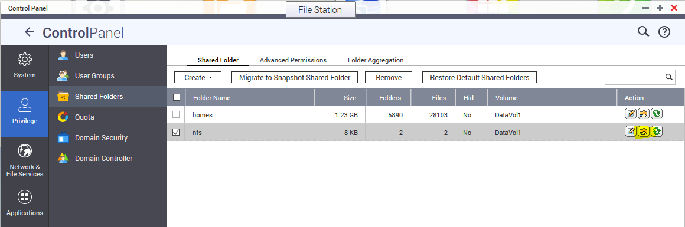
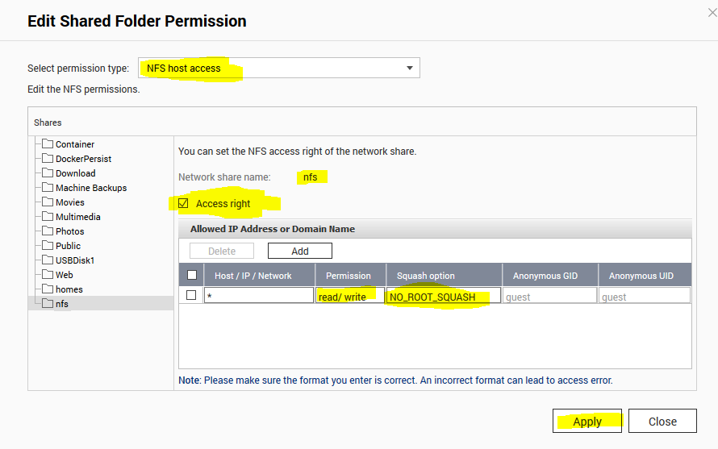

# NFS with QNAP and Ubuntu 16.04


## Create a share on your QNAP
1. Create a new shared folder on your QNAP

1. Navigate to the shared folder permissions. Control Panel > Privilege > Shared Folders > Click icon for Edit Shared Folder Permission.



2. Select the settings as highlighted. Make sure the permission type is "NFS host access", select Access right = True and permission = read/write.


## Install client NFS software on Ubuntu
```bash
sudo apt install nfs-common
```

## Create a new mount directory on the local file system
```bash
sudo mkdir -p /nfs
```

## Mount the NFS drive on the local file system
```bash
sudo mount -w -v -t nfs -o user=nfsuser1 192.168.1.1:/nfs /nfs
```
*Replace the IP address with the IP address of your QNAP and the /nfs with the name of your share and mount point and the user name with your user*